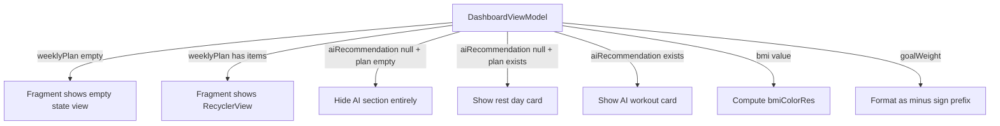

# Dashboard Home Tab — Empty States & Polish Fix

**Date:** 2026-05-21
**Status:** Draft
**Scope:** Fix 7 remaining visual/UX issues on the Home tab after the previous overhaul

---

## Overview

The previous overhaul (2026-05-21-dashboard-home-overhaul) fixed the architecture and data flow, but the current running app still shows problems: empty weekly plan with no guidance, hidden AI card leaving dead space, ambiguous goal stat, and missing BMI severity indicator. This spec addresses all remaining visual polish issues.

---

## Issues Addressed

| # | Category | Issue | Root Cause |
|---|----------|-------|------------|
| 1 | Empty State | Weekly plan shows header + empty space when no workouts exist | No empty state view; RecyclerView is simply empty |
| 2 | Empty State | AI Workout card hidden with no replacement content | `View.GONE` with nothing shown instead |
| 3 | UX | 60%+ of screen is dead black space | Combination of issues 1 and 2 |
| 4 | Visual | BMI category text has no color coding for severity | Plain text with no visual weight |
| 5 | Data Clarity | Goal stat shows raw number without direction context | User sees "6 KG" but meaning is ambiguous |
| 6 | UX | No call-to-action when no plan exists | User has no guidance on what to do next |
| 7 | Visual | Stat card spacing feels cramped | Only 4dp between value and unit |

---

## Architecture

No structural architecture changes needed. All fixes are within the existing ViewModel-driven pattern:
- `DashboardViewModel` — add BMI color logic and goal formatting
- `DashboardFragment` — add empty state visibility toggling and BMI color binding
- XML layouts — add empty state views and adjust spacing



---

## Detailed Design

### 1. Empty State for Weekly Plan

**Location:** Below the weekly plan header in [`fragment_dashboard.xml`](app/src/main/res/layout/fragment_dashboard.xml)

**New view:** `LinearLayout` with id `layout_empty_plan`, visibility controlled by Fragment.

```xml
<!-- Empty state for weekly plan -->
<LinearLayout
    android:id="@+id/layout_empty_plan"
    android:layout_width="match_parent"
    android:layout_height="wrap_content"
    android:layout_marginTop="@dimen/spacing_xl"
    android:gravity="center"
    android:orientation="vertical"
    android:padding="@dimen/spacing_xl"
    android:visibility="gone">

    <TextView
        android:layout_width="wrap_content"
        android:layout_height="wrap_content"
        android:text="📋"
        android:textSize="48sp" />

    <TextView
        android:layout_width="wrap_content"
        android:layout_height="wrap_content"
        android:layout_marginTop="@dimen/spacing_md"
        android:text="@string/empty_plan_title"
        android:textAppearance="@style/TextStyle.BodyBold" />

    <TextView
        android:layout_width="wrap_content"
        android:layout_height="wrap_content"
        android:layout_marginTop="@dimen/spacing_xs"
        android:gravity="center"
        android:text="@string/empty_plan_subtitle"
        android:textAppearance="@style/TextStyle.BodyBase" />

    <com.google.android.material.button.MaterialButton
        android:id="@+id/btn_create_plan"
        style="@style/Widget.SmartGym.Button.Outline"
        android:layout_width="wrap_content"
        android:layout_height="48dp"
        android:layout_marginTop="@dimen/spacing_lg"
        android:text="@string/btn_create_plan" />
</LinearLayout>
```

**Visibility logic in Fragment:**
```java
viewModel.getWeeklyPlan().observe(owner, plan -> {
    boolean isEmpty = plan == null || plan.isEmpty();
    binding.rvWeeklyPlan.setVisibility(isEmpty ? View.GONE : View.VISIBLE);
    binding.layoutEmptyPlan.setVisibility(isEmpty ? View.VISIBLE : View.GONE);
    weeklyPlanAdapter.submitList(plan);
});
```

**Click handler for "Tạo kế hoạch" button:**
```java
binding.btnCreatePlan.setOnClickListener(v -> {
    BottomNavigationView nav = requireActivity().findViewById(R.id.bottom_nav);
    if (nav != null) nav.setSelectedItemId(R.id.nav_workout);
});
```

---

### 2. Rest Day Card (AI Recommendation Empty State)

**Condition:** `aiRecommendation == null` AND `weeklyPlan` is NOT empty (user has a plan, just not for today)

**New view:** Replaces the hidden AI card with a rest day message.

```xml
<!-- Rest day card -->
<androidx.cardview.widget.CardView
    android:id="@+id/card_rest_day"
    android:layout_width="match_parent"
    android:layout_height="wrap_content"
    android:layout_marginTop="@dimen/spacing_lg"
    android:visibility="gone"
    app:cardBackgroundColor="@color/surface_container"
    app:cardCornerRadius="@dimen/radius_lg"
    app:cardElevation="0dp">

    <LinearLayout
        android:layout_width="match_parent"
        android:layout_height="wrap_content"
        android:gravity="center_vertical"
        android:orientation="horizontal"
        android:padding="@dimen/spacing_lg">

        <TextView
            android:layout_width="wrap_content"
            android:layout_height="wrap_content"
            android:text="🧘"
            android:textSize="36sp" />

        <LinearLayout
            android:layout_width="0dp"
            android:layout_height="wrap_content"
            android:layout_marginStart="@dimen/spacing_md"
            android:layout_weight="1"
            android:orientation="vertical">

            <TextView
                android:layout_width="match_parent"
                android:layout_height="wrap_content"
                android:text="@string/rest_day_title"
                android:textAppearance="@style/TextStyle.BodyBold" />

            <TextView
                android:layout_width="match_parent"
                android:layout_height="wrap_content"
                android:layout_marginTop="@dimen/spacing_xs"
                android:text="@string/rest_day_subtitle"
                android:textAppearance="@style/TextStyle.BodyBase" />
        </LinearLayout>
    </LinearLayout>
</androidx.cardview.widget.CardView>
```

**Visibility logic in Fragment (update existing AI observation):**
```java
viewModel.getAiRecommendation().observe(owner, workout -> {
    if (workout != null) {
        binding.cardAiWorkout.setVisibility(View.VISIBLE);
        binding.cardRestDay.setVisibility(View.GONE);
        binding.tvWorkoutTitle.setText(workout.getTitle());
        int exerciseCount = workout.getExercises() != null ? workout.getExercises().size() : 0;
        binding.tvWorkoutSubtitle.setText(getString(
            R.string.workout_subtitle_format, exerciseCount,
            workout.getDurationMinutes(),
            workout.getIntensity() != null ? workout.getIntensity() : ""));
    } else {
        binding.cardAiWorkout.setVisibility(View.GONE);
        // Show rest day card only if user has a plan
        List<Workout> plan = viewModel.getWeeklyPlan().getValue();
        boolean hasPlan = plan != null && !plan.isEmpty();
        binding.cardRestDay.setVisibility(hasPlan ? View.VISIBLE : View.GONE);
    }
});
```

---

### 3. BMI Category Color Coding

**New LiveData in DashboardViewModel:**
```java
private final MutableLiveData<Integer> bmiColorRes = new MutableLiveData<>(R.color.on_surface_variant);

public LiveData<Integer> getBmiColorRes() { return bmiColorRes; }
```

**Color computation logic (inside `onSuccess` user callback):**
```java
private int computeBmiColor(float bmiValue) {
    if (bmiValue < 18.5f) return R.color.tertiary;          // Cyan — underweight
    if (bmiValue < 25.0f) return R.color.primary;           // Lime — normal
    if (bmiValue < 30.0f) return R.color.warning;           // Orange — overweight
    return R.color.error;                                    // Red — obese
}
```

**New color in [`colors.xml`](app/src/main/res/values/colors.xml):**
```xml
<color name="warning">#FFFFB74D</color>
```

**Fragment binding:**
```java
viewModel.getBmiColorRes().observe(owner, colorRes -> {
    int color = ContextCompat.getColor(requireContext(), colorRes);
    binding.statBmi.tvStatValue.setTextColor(color);
    binding.statBmi.tvStatUnit.setTextColor(color);
});
```

---

### 4. Goal Stat — Display as Weight Loss Direction

**ViewModel change:** Add formatted goal text instead of raw number.

New LiveData:
```java
private final MutableLiveData<String> goalDisplay = new MutableLiveData<>("0");
public LiveData<String> getGoalDisplay() { return goalDisplay; }
```

Formatting logic:
```java
int goal = parseGoalWeight(user.getGoal());
goalWeight.postValue(goal);
goalDisplay.postValue(goal > 0 ? "−" + goal : "0");  // minus sign U+2212
```

**Fragment binding update (REPLACES existing `getGoalWeight()` observer):**
```java
// Remove: viewModel.getGoalWeight().observe(owner, goal -> ...)
// Replace with:
viewModel.getGoalDisplay().observe(owner, display ->
    binding.statGoal.tvStatValue.setText(display));
```

**Stat card label stays "MỤC TIÊU", unit stays "KG"** — the minus prefix on the number makes direction clear. The `goalWeight` integer LiveData remains available for other consumers but is no longer observed by Fragment directly.

---

### 5. Stat Card Spacing Improvement

**File:** [`item_stat_card.xml`](app/src/main/res/layout/item_stat_card.xml)

Changes:
- Value `marginTop`: `spacing_xs` (4dp) → `spacing_sm` (8dp)
- Add `marginTop="@dimen/spacing_xs"` to unit TextView (currently no margin)
- Increase card padding from `spacing_md` (12dp) to `spacing_lg` (16dp)

Updated XML:
```xml
<LinearLayout
    android:layout_width="match_parent"
    android:layout_height="wrap_content"
    android:background="@drawable/bg_stat_card_rounded"
    android:gravity="center_horizontal"
    android:orientation="vertical"
    android:padding="@dimen/spacing_lg">

    <TextView
        android:id="@+id/tv_stat_label"
        android:layout_width="wrap_content"
        android:layout_height="wrap_content"
        android:text="Label"
        android:textAppearance="@style/TextStyle.LabelCaps" />

    <TextView
        android:id="@+id/tv_stat_value"
        android:layout_width="wrap_content"
        android:layout_height="wrap_content"
        android:layout_marginTop="@dimen/spacing_sm"
        android:text="0"
        android:textAppearance="@style/TextStyle.HeadlineMd"
        android:textColor="@color/primary" />

    <TextView
        android:id="@+id/tv_stat_unit"
        android:layout_width="wrap_content"
        android:layout_height="wrap_content"
        android:layout_marginTop="@dimen/spacing_xs"
        android:text="unit"
        android:textAppearance="@style/TextStyle.LabelCaps" />
</LinearLayout>
```

---

## New String Resources

Add to [`strings.xml`](app/src/main/res/values/strings.xml):

```xml
<!-- Empty states -->
<string name="empty_plan_title">Chưa có kế hoạch tuần</string>
<string name="empty_plan_subtitle">Hãy tạo kế hoạch tập luyện để bắt đầu hành trình</string>
<string name="btn_create_plan">Tạo kế hoạch</string>
<string name="rest_day_title">Hôm nay là ngày nghỉ!</string>
<string name="rest_day_subtitle">Hãy nghỉ ngơi để cơ thể phục hồi 💪</string>
```

---

## New Color Resource

Add to [`colors.xml`](app/src/main/res/values/colors.xml):

```xml
<color name="warning">#FFFFB74D</color>
```

---

## Files Modified

| File | Changes |
|------|---------|
| `fragment_dashboard.xml` | Add empty plan layout, add rest day card |
| `item_stat_card.xml` | Increase padding and margins |
| `DashboardViewModel.java` | Add `bmiColorRes` LiveData, `goalDisplay` LiveData, `computeBmiColor()` |
| `DashboardFragment.java` | Add empty state visibility logic, BMI color binding, goal display binding, create plan click handler |
| `strings.xml` | Add 5 new string entries |
| `colors.xml` | Add `warning` color |

## Files Created

None — all changes are modifications to existing files.

---

## Edge Cases

| Scenario | Behavior |
|----------|----------|
| Plan is empty and AI rec is null | AI card hidden, rest day card hidden, empty plan state shown |
| Plan exists but today has no workout | AI card hidden, rest day card shown, weekly plan RecyclerView shown |
| Plan exists and today has workout | AI card shown, rest day card hidden, weekly plan shown |
| BMI is 0 (no data) | Color stays default `on_surface_variant`, category text empty |
| Goal is 0 or not set | Display shows "0" with no minus prefix |
| Goal is negative (edge case) | Treat absolute value, still show "−N" |

---

## Testing Approach

**Unit tests for DashboardViewModel:**
- `computeBmiColor()` returns correct color resource for boundary values (18.4, 18.5, 24.9, 25.0, 29.9, 30.0)
- `goalDisplay` formats correctly: goal=6 → "−6", goal=0 → "0"
- `bmiColorRes` updates when BMI value changes

**Manual verification:**
- Empty state view shows when user has no weekly plan
- Rest day card shows when plan exists but today has no workout
- "Tạo kế hoạch" button navigates to workout/plan tab
- BMI stat card text turns orange when BMI is 25-30
- Goal stat shows "−6" clearly
- Stat cards have visually better spacing

---

## Implementation Order

1. Add new strings and color to resources
2. Update `item_stat_card.xml` spacing
3. Add empty plan layout and rest day card to `fragment_dashboard.xml`
4. Add `bmiColorRes`, `goalDisplay`, and `computeBmiColor()` to `DashboardViewModel`
5. Update `DashboardFragment` with empty state logic, BMI color binding, and goal display
6. Verify all 7 issues resolved
