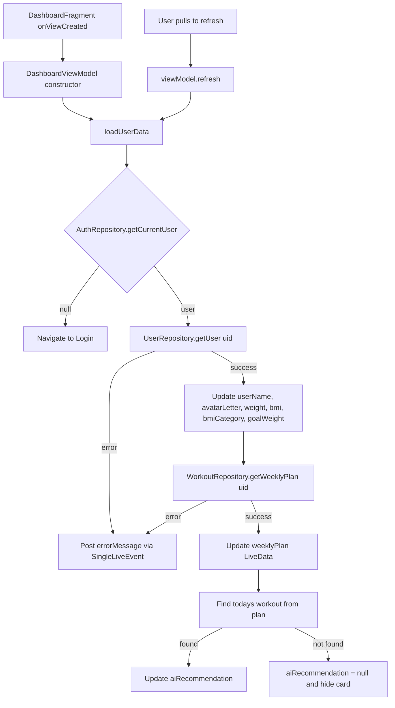
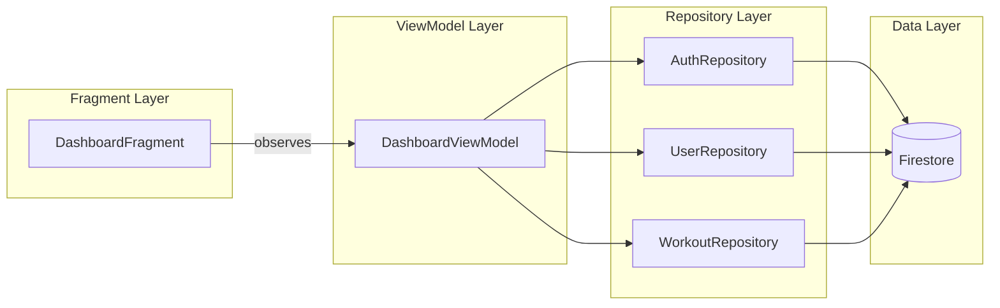

# Dashboard Home Tab — Full Overhaul Design Spec

**Date:** 2026-05-21
**Status:** Approved
**Scope:** Fix 15 identified issues in the Dashboard Home tab via ViewModel-Driven Refactor

---

## Overview

Complete overhaul of the Dashboard Home tab to fix all 15 identified issues: empty weekly plan, hardcoded stats, missing loading/error states, ugly system icons, non-functional interactions, and architecture violations.

**Approach:** ViewModel-Driven Refactor — DashboardViewModel becomes the single source of truth; DashboardFragment becomes a pure observer/renderer.

---

## Issues Addressed

| # | Category | Issue | Root Cause |
|---|----------|-------|------------|
| 1 | Data | Weekly plan always empty | Adapter never receives data — ViewModel has no weekly plan LiveData |
| 2 | Data | BMI never updates from Firestore | `observeViewModel()` observes weight but not BMI |
| 3 | Data | Goal weight hardcoded to 65 | Never reads from user profile |
| 4 | Data | Avatar always shows "U" | XML hardcoded, never computed from user name |
| 5 | Data | Silent error swallowing | `onError` callback does nothing |
| 6 | Visual | Stat cards no rounded corners | Flat background without corner radius |
| 7 | Visual | System notification icon | Uses `@android:drawable/ic_popup_reminder` |
| 8 | Visual | Play button uses text emoji | `"▶ Bắt đầu"` instead of proper icon |
| 9 | Visual | No loading state | Hardcoded fallback values shown instantly |
| 10 | UX | Conflicting click targets | Card → AI Analysis, Button → Workout Detail (button inside card) |
| 11 | UX | "XEM TẤT CẢ" not clickable | No id, no click listener |
| 12 | UX | No pull-to-refresh | Cannot refresh data after initial load |
| 13 | UX | AI recommendation is static | Always shows "Upper Body Blast" |
| 14 | Polish | Hardcoded Vietnamese strings | Not in strings.xml |
| 15 | Polish | BMI category not observed | User model has bmiCategory but never displayed dynamically |

---

## Architecture

### Data Flow



### Component Diagram



---

## Detailed Design

### 1. DashboardViewModel Redesign

**File:** `app/src/main/java/ntu/quy65132908/smartgym_ai/ui/dashboard/DashboardViewModel.java`

**Dependencies (injected):**
- `AuthRepository` — get current user
- `UserRepository` — fetch user profile
- `WorkoutRepository` — fetch weekly plan

**Exposed LiveData:**

| LiveData | Type | Default | Source |
|----------|------|---------|--------|
| `userName` | `String` | `"Bạn"` | `User.displayName` |
| `avatarLetter` | `String` | `"U"` | `displayName.charAt(0)` uppercase |
| `weight` | `Integer` | `0` | `User.weight` cast to int |
| `bmi` | `Float` | `0f` | `User.bmi` |
| `bmiCategory` | `String` | `""` | `User.bmiCategory` |
| `goalWeight` | `Integer` | `0` | Parsed from `User.goal` — extract first numeric value via regex `\\d+`, fallback to 0 if null/unparseable |
| `aiRecommendation` | `Workout` (nullable) | `null` | Today's workout from weekly plan |
| `weeklyPlan` | `List<Workout>` | `emptyList()` | `WorkoutRepository.getWeeklyPlan()` |
| `isLoading` | `Boolean` | `true` | Set false after first load |
| `isRefreshing` | `Boolean` | `false` | Set during pull-to-refresh |
| `errorMessage` | `SingleLiveEvent<String>` | — | Fires once on error |

**Methods:**
- `refresh()` — triggers full data reload, sets `isRefreshing = true`
- `loadUserData()` — private, called in constructor and `refresh()`

**Logic for AI Recommendation:**
```
1. Get weeklyPlan list
2. Compute todayDayOfWeek (1=Mon...7=Sun from Calendar)
3. Find workout where workout.dayOfWeek == todayDayOfWeek
4. If found → set aiRecommendation to that workout
5. If not found → set aiRecommendation to null (Fragment hides the card)
```

**Error handling:**
- On `UserRepository.onError`: post error message string, keep `isLoading = false`
- On `WorkoutRepository.onError`: post error message, weeklyPlan stays empty

---

### 2. DashboardFragment Refactor

**File:** `app/src/main/java/ntu/quy65132908/smartgym_ai/ui/dashboard/DashboardFragment.java`

**Principle:** Fragment is a pure observer. No data logic. No `findViewById` for stat card internals.

**Structure:**
```java
@AndroidEntryPoint
public class DashboardFragment extends Fragment {

    private FragmentDashboardBinding binding;
    private DashboardViewModel viewModel;
    private WeeklyPlanAdapter weeklyPlanAdapter;

    onCreateView() → inflate binding
    
    onViewCreated() {
        viewModel = new ViewModelProvider(this).get(DashboardViewModel.class);
        setupRecyclerView();
        setupSwipeRefresh();
        setupClickListeners();
        observeViewModel();
    }

    setupRecyclerView() {
        weeklyPlanAdapter = new WeeklyPlanAdapter();
        binding.rvWeeklyPlan.setLayoutManager(new LinearLayoutManager(context));
        binding.rvWeeklyPlan.setAdapter(weeklyPlanAdapter);
    }

    setupSwipeRefresh() {
        binding.swipeRefresh.setColorSchemeResources(R.color.primary);
        binding.swipeRefresh.setOnRefreshListener(() -> viewModel.refresh());
    }

    setupClickListeners() {
        binding.btnStartWorkout.setOnClickListener(v -> {
            Workout rec = viewModel.getAiRecommendation().getValue();
            if (rec != null) {
                Bundle args = new Bundle();
                args.putString("workoutId", rec.getId());
                Navigation.findNavController(v).navigate(
                    R.id.action_dashboard_to_workout_detail, args);
            }
        });

        binding.tvViewAll.setOnClickListener(v -> {
            // Navigate to Workout/Plan tab
            BottomNavigationView nav = requireActivity().findViewById(R.id.bottom_nav);
            nav.setSelectedItemId(R.id.nav_workout);
        });
    }

    observeViewModel() {
        viewModel.getUserName().observe(owner, name ->
            binding.tvGreeting.setText(getString(R.string.greeting_format, name)));

        viewModel.getAvatarLetter().observe(owner, letter ->
            binding.tvAvatar.setText(letter));

        viewModel.getWeight().observe(owner, w -> {
            binding.statWeight.tvStatValue.setText(String.valueOf(w));
        });

        viewModel.getBmi().observe(owner, bmi -> {
            binding.statBmi.tvStatValue.setText(String.format("%.1f", bmi));
        });

        viewModel.getBmiCategory().observe(owner, cat -> {
            binding.statBmi.tvStatUnit.setText(cat);
        });

        viewModel.getGoalWeight().observe(owner, goal -> {
            binding.statGoal.tvStatValue.setText(String.valueOf(goal));
        });

        viewModel.getAiRecommendation().observe(owner, workout -> {
            if (workout != null) {
                binding.cardAiWorkout.setVisibility(View.VISIBLE);
                binding.tvWorkoutTitle.setText(workout.getTitle());
                binding.tvWorkoutSubtitle.setText(getString(
                    R.string.workout_subtitle_format,
                    workout.getExercises() != null ? workout.getExercises().size() : 0,
                    workout.getDurationMinutes(),
                    workout.getIntensity()));
            } else {
                binding.cardAiWorkout.setVisibility(View.GONE);
            }
        });

        viewModel.getWeeklyPlan().observe(owner, plan ->
            weeklyPlanAdapter.submitList(plan));

        viewModel.getIsLoading().observe(owner, loading ->
            binding.progressBar.setVisibility(loading ? View.VISIBLE : View.GONE));

        viewModel.getIsRefreshing().observe(owner, refreshing ->
            binding.swipeRefresh.setRefreshing(refreshing));

        viewModel.getErrorMessage().observe(owner, msg ->
            Snackbar.make(binding.getRoot(), msg, Snackbar.LENGTH_LONG).show());
    }

    onDestroyView() {
        binding = null;
    }
}
```

**Removed:**
- `setupStatCards()` method entirely
- `cardAiWorkout.setOnClickListener` (no more conflicting click)
- All hardcoded stat label strings from Java code

---

### 3. Layout XML Changes

#### 3.1 fragment_dashboard.xml

**Structural changes:**
1. Wrap `NestedScrollView` with `SwipeRefreshLayout` (id: `swipe_refresh`)
2. Add `ProgressBar` at top (id: `progress_bar`, shown during initial load)
3. Replace notification icon: `@android:drawable/ic_popup_reminder` → `@drawable/ic_notification_bell`
4. Add `android:id="@+id/tv_view_all"` to "XEM TẤT CẢ" TextView
5. Remove `android:clickable` from `card_ai_workout`
6. Replace button text `"▶ Bắt đầu"` with `@string/btn_start` and add `app:icon="@drawable/ic_play_circle"` + `app:iconGravity="textStart"`

**Static stat labels stay in XML** (using string resources):
- `stat_weight` → label from `@string/stat_label_weight`, unit from `@string/stat_unit_kg`
- `stat_bmi` → label from `@string/stat_label_bmi`
- `stat_goal` → label from `@string/stat_label_goal`, unit from `@string/stat_unit_kg`

#### 3.2 item_stat_card.xml

Replace root `LinearLayout` background:
- Before: `android:background="@color/surface_container"` (flat)
- After: `android:background="@drawable/bg_stat_card_rounded"` (12dp rounded corners)

---

### 4. New Resources

#### 4.1 Drawables

**`res/drawable/bg_stat_card_rounded.xml`**
```xml
<shape xmlns:android="http://schemas.android.com/apk/res/android">
    <solid android:color="@color/surface_container" />
    <corners android:radius="@dimen/radius_md" />
</shape>
```

**`res/drawable/ic_notification_bell.xml`**
Material Design bell/notification icon vector (24dp, `on_surface_variant` tint)

**`res/drawable/ic_play_circle.xml`**
Material Design play_arrow icon vector (20dp, used as button icon)

#### 4.2 Strings

**Added to `res/values/strings.xml`:**
```xml
<string name="greeting_format">Chào %1$s! 💪</string>
<string name="stat_label_weight">CÂN NẶNG</string>
<string name="stat_label_bmi">BMI</string>
<string name="stat_label_goal">MỤC TIÊU</string>
<string name="stat_unit_kg">kg</string>
<string name="ai_suggestion_label">⚡ AI ĐỀ XUẤT</string>
<string name="btn_start">Bắt đầu</string>
<string name="workout_subtitle_format">%1$d bài • %2$d phút • %3$s</string>
<string name="error_load_dashboard">Không thể tải dữ liệu. Kéo xuống để thử lại.</string>
<string name="no_workout_today">Hôm nay không có bài tập. Hãy nghỉ ngơi! 🧘</string>
```

---

### 5. WeeklyPlanAdapter (Minimal Changes)

**File:** `app/src/main/java/ntu/quy65132908/smartgym_ai/ui/dashboard/WeeklyPlanAdapter.java`

No structural changes needed — it already uses `ListAdapter` with `DiffUtil`. It just needs to actually receive data via `submitList()` from the Fragment observer (which is the fix for issue #1).

---

## Files Modified

| File | Changes |
|------|---------|
| `DashboardViewModel.java` | Complete rewrite — add all LiveData fields, inject WorkoutRepository, implement `loadUserData()` and `refresh()` |
| `DashboardFragment.java` | Rewrite to pure observer pattern — remove `setupStatCards()`, add `setupSwipeRefresh()`, add all observers |
| `fragment_dashboard.xml` | Add SwipeRefreshLayout wrapper, ProgressBar, fix notification icon, add view_all id, add button icon, set static labels from strings |
| `item_stat_card.xml` | Replace flat background with rounded drawable |
| `strings.xml` | Add 10 new string entries |

## Files Created

| File | Purpose |
|------|---------|
| `res/drawable/bg_stat_card_rounded.xml` | Rounded 12dp corner background for stat cards |
| `res/drawable/ic_notification_bell.xml` | Material notification bell icon |
| `res/drawable/ic_play_circle.xml` | Play icon for start button |

## Files Unchanged

| File | Reason |
|------|--------|
| `WeeklyPlanAdapter.java` | Already correct — just needs data from ViewModel |
| `WorkoutRepository.java` | Already has `getWeeklyPlan()` method |
| `UserRepository.java` | Already has `getUser()` returning full User model |
| `nav_graph.xml` | Actions already defined correctly |

---

## Edge Cases

| Scenario | Behavior |
|----------|----------|
| New user with no profile data | Stats show 0/empty, greeting says "Chào Bạn!", no AI recommendation card shown |
| User has no weekly plan | Weekly plan section empty, AI recommendation card hidden, show `no_workout_today` message |
| Network error on load | Snackbar with retry hint, previous data preserved if any |
| User has no goal set | Goal stat shows 0 |
| User display name is empty/null | Avatar shows "U", greeting says "Chào Bạn!" |
| Pull-to-refresh while loading | Ignore refresh if already loading |

---

## Testing Approach

**Unit tests for DashboardViewModel:**
- Verify `avatarLetter` computed correctly from display name
- Verify `aiRecommendation` selects correct day's workout
- Verify error state fires `SingleLiveEvent`
- Verify `isLoading` transitions: true → false on success/error
- Verify `goalWeight` parsing from User.goal string

**Manual testing:**
- Pull-to-refresh triggers reload
- Start button navigates with workoutId
- "XEM TẤT CẢ" switches to workout tab
- Stat cards display with rounded corners
- Proper icons for notification and play button

---

## Implementation Order

1. Create new drawable resources (bg_stat_card_rounded, ic_notification_bell, ic_play_circle)
2. Add string entries to strings.xml
3. Rewrite DashboardViewModel with all LiveData and logic
4. Update fragment_dashboard.xml (SwipeRefresh, ProgressBar, icons, ids)
5. Update item_stat_card.xml (rounded background)
6. Rewrite DashboardFragment observers and click handlers
7. Run and verify all 15 issues resolved
