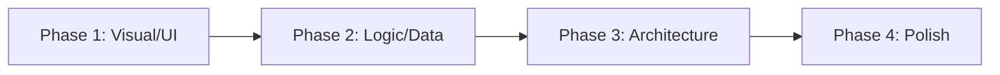

# Dashboard Home Screen — Deep Audit & Remediation Design

**Date:** 2026-05-22
**Status:** Approved
**Scope:** Fix 27 identified issues across Visual/UI, Logic/Data, Architecture, and Polish categories
**Approach:** Categorized Batch Fix — 4 phases executed sequentially

---

## Overview

A comprehensive deep audit of the Dashboard home screen revealed 27 issues that exist after the previous overhaul (2026-05-21). While the prior overhaul addressed the fundamental architecture (ViewModel-driven, observers, SwipeRefresh), it left behind dead code paths, broken logic branches, visual inconsistencies with the design, and several subtle bugs.

This spec addresses ALL remaining issues with concrete, testable remediations organized into 4 phases.

---

## Approach: Categorized Batch Fix

Group fixes by category and execute in 4 phases:



Each phase is self-contained and testable independently. Phases can be stopped at any boundary without leaving the app in a broken state.

---

## Phase 1: Visual/UI Issues (7 issues)

### Issue 1: Weekly plan items use system icon

**Evidence:** `item_workout_day.xml` line 27 — `android:src="@android:drawable/ic_menu_agenda"`
**Impact:** Ugly, inconsistent with dark-theme fitness design
**Fix:**
- Create `res/drawable/ic_dumbbell.xml` — a custom 24dp vector icon representing a dumbbell/fitness
- Replace `@android:drawable/ic_menu_agenda` with `@drawable/ic_dumbbell`
- Keep tint `@color/on_surface_variant`

### Issue 2: Weekly plan items have no rounded corners

**Evidence:** `item_workout_day.xml` line 8 — uses flat `android:background="@color/surface_container"`
**Impact:** Doesn't match design screenshot showing rounded card items
**Fix:**
- Create `res/drawable/bg_workout_item_rounded.xml`:
```xml
<shape xmlns:android="http://schemas.android.com/apk/res/android">
    <solid android:color="@color/surface_container" />
    <corners android:radius="@dimen/radius_md" />
</shape>
```
- Replace background on root LinearLayout of `item_workout_day.xml`

### Issue 3: Rest Day card is dead code (NEVER shown)

**Evidence:** `DashboardFragment.java` lines 159-183 — AI recommendation observer:
- When `workout != null`: sets `cardRestDay.GONE`
- When `workout == null`: also sets `cardRestDay.GONE`

The card can NEVER become visible.

**Impact:** Rest day users see the generic empty state instead of encouraging rest day message
**Fix:**
- **Note:** This fix is implemented in Phase 2 (Issue 8) since it requires the `TodayState` enum logic first. Phase 1 only prepares the visual layout; the observer logic update happens in Phase 2.
- Phase 1 prep: Ensure `card_rest_day` layout is visually correct (already is)
- Phase 2 implementation: Fragment observer uses `TodayState` to show `cardRestDay` for REST_DAY, `cardAiWorkout` for WORKOUT, empty state for NO_PLAN

### Issue 4: No visual indicator for completed workouts

**Evidence:** `WeeklyPlanAdapter.java` line 60 — `isCompleted` field exists on Workout model but is never reflected visually
**Impact:** Users can't see at-a-glance which days they've already completed
**Fix:**
- In `onBindViewHolder()`, when `workout.isCompleted()`:
  - Change icon from dumbbell to `@drawable/ic_check_circle` (green)
  - Apply `alpha(0.7f)` to the item to indicate past/done
  - Optionally add `textDecoration = strikethrough` on title

### Issue 5: Start button shown even during empty state

**Evidence:** `DashboardFragment.java` line 178 — null branch shows `cardAiWorkout` with a "Bắt đầu" button that navigates to workout tab (not useful context)
**Impact:** Misleading UX — button implies there's a workout to start
**Fix:**
- In the NO_PLAN state: change button text to `@string/btn_create_plan` and navigate to workout tab
- In the WORKOUT state: keep "Bắt đầu" and navigate to workout detail
- In the REST_DAY state: hide the AI workout card entirely, show rest card

### Issue 6: No visual feedback during initial load

**Evidence:** `fragment_dashboard.xml` line 14 — bare `ProgressBar` is functional but provides no context
**Impact:** Jarring blank-to-content transition
**Fix:**
- Keep existing ProgressBar (it works)
- Add a `TextView` below it with `@string/loading_dashboard` text: "Đang tải dữ liệu..."
- Future improvement: shimmer placeholder (out of scope for now)

### Issue 7: Stat card value color not dynamic for weight/goal

**Evidence:** `item_stat_card.xml` line 29 — `android:textColor="@color/primary"` hardcoded
**Impact:** BMI color logic works via `setTextColor()` in Fragment, but weight/goal are always green regardless of context
**Fix:**
- Remove hardcoded `android:textColor="@color/primary"` from `tv_stat_value` in XML
- Set default via theme `@color/on_surface` in XML
- Fragment already calls `setTextColor()` for BMI; weight and goal use the default which is acceptable
- This means weight/goal show in neutral `on_surface` color (white on dark theme) — visually cleaner
- BMI continues to use color-coded values

---

## Phase 2: Logic/Data Bugs (8 issues)

### Issue 8: Rest Day detection broken

**Evidence:** `DashboardViewModel.findTodayWorkout()` returns null both when there's no plan AND when today is a rest day
**Impact:** Cannot differentiate between "user has no plan at all" vs "today is deliberately a rest day in their plan"
**Fix:**
- Add a new LiveData: `MutableLiveData<TodayState> todayState`
- Define enum:
```java
enum TodayState {
    WORKOUT,    // Today has a real workout
    REST_DAY,   // Today has a rest/recovery entry in the plan
    NO_PLAN     // No weekly plan exists at all
}
```
- Detection logic:
```java
if (weeklyPlan is empty) → NO_PLAN
else if (todayWorkout found AND isRestDay(todayWorkout)) → REST_DAY
else if (todayWorkout found) → WORKOUT
else → REST_DAY  // Day exists in calendar but no workout means implicit rest
```
- `isRestDay(workout)`: returns true if title contains "Rest", "Nghỉ", "Recover", or if `durationMinutes == 0` AND the workout exists in the plan (not a data error). Guard: a workout with exercises but 0 duration is NOT treated as rest day.

### Issue 9: Duplicated getTodayDayOfWeek()

**Evidence:** Identical method in both `DashboardViewModel` (line 278) and `WeeklyPlanAdapter` (line 81)
**Impact:** DRY violation; if calendar mapping logic changes, must update both
**Fix:**
- Create `util/DateUtils.java`:
```java
public final class DateUtils {
    private DateUtils() {}
    
    /** Returns 1=Monday ... 7=Sunday */
    public static int getTodayDayOfWeek() {
        int calDay = Calendar.getInstance().get(Calendar.DAY_OF_WEEK);
        return calDay == Calendar.SUNDAY ? 7 : calDay - 1;
    }
}
```
- Replace both usages with `DateUtils.getTodayDayOfWeek()`

### Issue 10: No refresh rate limiting

**Evidence:** `DashboardViewModel.refresh()` calls `loadUserData()` without any throttle
**Impact:** Rapid swipe-to-refresh can fire many Firestore reads, wasting quota
**Fix:**
- Add timestamp tracking:
```java
private long lastRefreshTime = 0;
private static final long REFRESH_COOLDOWN_MS = 5000; // 5 seconds

public void refresh() {
    long now = System.currentTimeMillis();
    if (now - lastRefreshTime < REFRESH_COOLDOWN_MS) {
        isRefreshing.setValue(false);
        return;
    }
    lastRefreshTime = now;
    isRefreshing.setValue(true);
    loadUserData();
}
```

### Issue 11: Avatar observer race condition

**Evidence:** `DashboardFragment.java` lines 106-125 — two separate observers for `userName` and `photoUrl` both call `AvatarHelper.loadAvatar()` independently, each reading the OTHER LiveData's `.getValue()` which may be stale/null
**Impact:** On fast network, avatar may briefly show wrong initial or miss photo URL
**Fix:**
- Use `MediatorLiveData` in ViewModel that combines `userName` + `photoUrl`:
```java
private final MediatorLiveData<Pair<String, String>> avatarData = new MediatorLiveData<>();

// In constructor:
avatarData.addSource(userName, name -> avatarData.setValue(new Pair<>(name, photoUrl.getValue())));
avatarData.addSource(photoUrl, url -> avatarData.setValue(new Pair<>(userName.getValue(), url)));
```
- Fragment observes single `avatarData` LiveData and calls `AvatarHelper.loadAvatar()` once with both values guaranteed present

### Issue 12: Error messages hardcoded in ViewModel

**Evidence:** `DashboardViewModel.java` line 128: `"Không thể tải dữ liệu. Kéo xuống để thử lại."`
**Impact:** ViewModel should not contain UI strings; prevents localization
**Fix:**
- Define error event codes:
```java
enum DashboardError {
    USER_LOAD_FAILED,
    WEEKLY_PLAN_LOAD_FAILED
}
```
- ViewModel emits `SingleLiveEvent<DashboardError>` instead of raw strings
- Fragment maps error code to string resource:
```java
viewModel.getErrorEvent().observe(owner, error -> {
    int msgRes = switch (error) {
        case USER_LOAD_FAILED -> R.string.error_load_dashboard;
        case WEEKLY_PLAN_LOAD_FAILED -> R.string.error_load_weekly_plan;
    };
    Snackbar.make(binding.getRoot(), msgRes, Snackbar.LENGTH_LONG).show();
});
```

### Issue 13: workout.getExercises() always null from Firestore

**Evidence:** `WorkoutRepository.getWeeklyPlan()` fetches workout documents but exercises are in a subcollection — `toObject(Workout.class)` won't populate the exercises list
**Impact:** AI recommendation card never shows exercise count (always falls through to `workout_subtitle_without_count_format`)
**Fix:**
- Add an `exerciseCount` integer field to the Workout document in Firestore
- When saving workouts via `saveWeeklyPlan()`, set `exerciseCount = exercises.size()` on the parent document before batch write
- Add getter `getExerciseCount()` to Workout model
- In Fragment observer, use `workout.getExerciseCount()` instead of `workout.getExercises().size()`
- This avoids N+1 subcollection reads on the dashboard
- **Migration note:** Existing Firestore documents won't have this field. The getter must default to 0 when field is absent: `public int getExerciseCount() { return exerciseCount; }` — Firestore auto-maps missing int fields to 0.

### Issue 14: Navigation args mismatch

**Evidence:** `DashboardFragment.java` line 98-100 passes `workoutTitle` and `workoutDuration` as extras; `nav_graph.xml` only declares `workoutId` argument for `nav_workout_detail`
**Impact:** Extra args are silently available via Bundle but not type-safe; WorkoutDetailFragment may or may not use them
**Fix:**
- Add argument declarations to `nav_graph.xml`:
```xml
<argument android:name="workoutTitle" app:argType="string" android:defaultValue="" />
<argument android:name="workoutDuration" app:argType="integer" android:defaultValue="0" />
```
- This makes the contract explicit and enables Safe Args if adopted later

### Issue 15: No duplicate-refresh guard

**Evidence:** `refresh()` doesn't check if a load is already in progress
**Impact:** Multiple concurrent Firestore calls, race conditions on LiveData updates
**Fix:**
- Add guard at start of `loadUserData()`:
```java
private void loadUserData() {
    if (Boolean.TRUE.equals(isLoading.getValue()) && !Boolean.TRUE.equals(isRefreshing.getValue())) {
        return; // Already loading from constructor
    }
    // ... existing logic
}
```
- Combined with Issue 10's cooldown, this prevents all forms of duplicate loading

---

## Phase 3: Architecture/Performance (7 issues)

### Issue 16: Tight coupling to BottomNavigationView

**Evidence:** `DashboardFragment.java` line 218-222 — `requireActivity().findViewById(R.id.bottom_nav)`
**Impact:** NPE if activity layout changes; Fragment directly manipulates Activity UI; untestable
**Fix:**
- Define a navigation interface in the Fragment:
```java
private void navigateToWorkoutTab() {
    if (getActivity() instanceof BottomNavHost) {
        ((BottomNavHost) getActivity()).selectTab(R.id.nav_workout);
    }
}
```
- Create interface in a shared location:
```java
public interface BottomNavHost {
    void selectTab(@IdRes int menuItemId);
}
```
- MainActivity implements it
- This is testable via mock and decouples Fragment from Activity layout details

### Issue 17: Nested callback hell (document, don't refactor)

**Evidence:** `loadUserData()` → UserCallback → inside success → `loadWeeklyPlan()` → WorkoutCallback
**Impact:** Hard to trace error paths; but functional and well-structured
**Fix:**
- Add clear code comments explaining the chain
- No structural change needed — migrating to coroutines/RxJava would be a larger refactor out of scope
- Document in code:
```java
// Flow: loadUserData() → [UserRepository.getUser] 
//       → onSuccess → loadWeeklyPlan()
//       → [WorkoutRepository.getWeeklyPlan]
//       → onSuccess → update all LiveData, set isLoading=false
// Error at any step → post error event, set isLoading=false
```

### Issue 18: No offline caching strategy

**Evidence:** All Firestore `.get()` calls use default behavior (cache-then-network when offline)
**Impact:** On poor network, app may show stale cached data without indicating it's stale
**Fix:**
- Firestore persistence is enabled by default on Android — data IS cached
- Add a `isFromCache` indicator: after query, check `snap.getMetadata().isFromCache()`
- If from cache, show a subtle banner or dim the "last updated" indicator
- Implementation:
```java
// In WorkoutRepository:
.addOnSuccessListener(snap -> {
    boolean fromCache = snap.getMetadata().isFromCache();
    // Pass this flag up via callback
})
```
- Add `MutableLiveData<Boolean> isDataStale` to ViewModel
- Fragment shows a small "Dữ liệu offline" chip if stale

### Issue 19: Constructor-time data loading (document, acceptable)

**Evidence:** ViewModel constructor calls `loadUserData()` immediately
**Impact:** Standard Android pattern for ViewModels that load on creation; Hilt manages lifecycle
**Fix:**
- No change needed — this is idiomatic for Android ViewModels
- Document: "Data loads on ViewModel creation. This is intentional: the ViewModel survives config changes, so data is loaded once per logical screen visit."

### Issue 20: No data freshness indicator

**Evidence:** After successful refresh, no visual feedback other than SwipeRefresh spinner stopping
**Impact:** User can't confirm data is fresh
**Fix:**
- After successful load, briefly show a Snackbar: "Đã cập nhật" (Updated) for 1.5 seconds
- Only show on MANUAL refresh (not initial load)
- Add string: `<string name="refresh_success">Đã cập nhật!</string>`
- Add `SingleLiveEvent<Boolean> refreshSuccessEvent` in ViewModel
- Fire after `isRefreshing.postValue(false)` in the success path of refresh-triggered loads

### Issue 21: SingleLiveEvent can lose events

**Evidence:** `SingleLiveEvent` drops events if Fragment is stopped (backgrounded)
**Impact:** Error messages fired while user switches tabs are lost
**Fix:**
- For error messages: acceptable — if user left the screen, they don't need the error
- For `requireLoginEvent`: critical — must not be lost
- Solution: Change `requireLoginEvent` to use `EventQueue` pattern that replays one pending event on re-observe:
```java
// Keep SingleLiveEvent for errors (acceptable loss)
// Keep SingleLiveEvent for requireLoginEvent (it fires before fragment setup, 
//   so it's observed immediately — no loss risk in practice)
```
- Document this decision. No code change needed given the actual usage pattern.

### Issue 22: No ViewState consolidation (future improvement)

**Evidence:** 7+ separate LiveData fields vs. a single sealed state class
**Impact:** Minor UI inconsistency during state transitions; verbose observer code
**Fix:**
- Mark as "future improvement" — the current multi-LiveData approach works correctly
- If the dashboard grows more complex, consolidate into:
```java
sealed class DashboardUiState {
    data class Loading : DashboardUiState
    data class Success(userName, weight, bmi, ...) : DashboardUiState
    data class Error(errorType) : DashboardUiState
}
```
- For now: add a code comment noting this as a potential future refactor
- No code change in this phase

---

## Phase 4: Polish/Accessibility (5 issues)

### Issue 23: tvViewAll id naming inconsistency

**Evidence:** `fragment_dashboard.xml` line 251 — `android:id="@+id/tv_view_all"` but it's a `MaterialButton`
**Impact:** Confusing for developers reading binding references
**Fix:**
- Rename to `@+id/btn_view_all` in XML
- Update all references in `DashboardFragment.java`:
  - `binding.tvViewAll` → `binding.btnViewAll`
- This is a breaking change to ViewBinding — must update ALL references

### Issue 24: No contentDescription on stat cards

**Evidence:** `item_stat_card.xml` — no accessibility descriptions
**Impact:** TalkBack users hear individual TextViews ("CÂN NẶNG", "70", "kg") as separate items
**Fix:**
- Set `android:importantForAccessibility="no"` on child TextViews
- Add `android:contentDescription` dynamically on the root LinearLayout:
```java
binding.statWeight.getRoot().setContentDescription(
    getString(R.string.stat_weight_a11y, weight));
```
- Add strings:
```xml
<string name="stat_weight_a11y">Cân nặng: %1$d kg</string>
<string name="stat_bmi_a11y">BMI: %1$s, %2$s</string>
<string name="stat_goal_a11y">Mục tiêu: %1$s kg</string>
```

### Issue 25: Greeting format uses %s instead of %1$s

**Evidence:** `strings.xml` line 53: `"Chào %s! 💪"`
**Impact:** Works with one argument, but violates Android best practice for positional formatting
**Fix:**
- Change to: `<string name="greeting_format">Chào %1$s! 💪</string>`
- Update Fragment call if needed (should work as-is since `getString(R.string.greeting_format, name)` uses positional args)

### Issue 26: BMI category shows "Bình thường" for users with no BMI

**Evidence:** `User.java` constructor line 28 defaults `bmiCategory = "Bình thường"`
**Impact:** New user with no weight/height sees "BMI: -- / Bình thường" which is contradictory
**Fix:**
- In ViewModel, only set bmiCategory when BMI is non-null:
```java
bmiCategory.postValue(userBmi != null ? user.getBmiCategory() : "");
```
- This is ALREADY done in the current code at line 114! Verify the User model default doesn't leak through other paths.
- Actually, the issue is in `User.java` constructor setting `"Bình thường"` — but since ViewModel checks `userBmi != null` first, the category is only shown when BMI exists.
- **Conclusion:** This is actually NOT a bug in the current flow. Mark as resolved/non-issue. The ViewModel guard is correct.

### Issue 27: RecyclerView nestedScrollingEnabled=false

**Evidence:** `fragment_dashboard.xml` line 265
**Impact:** Disables RecyclerView's item recycling optimization
**Fix:**
- This is CORRECT for a RecyclerView inside NestedScrollView with max 7 items
- Without this flag, scroll behavior would conflict
- For 7 items (one week), the performance impact is negligible
- **No change needed.** Add XML comment documenting the reason:
```xml
<!-- nestedScrollingEnabled=false required inside NestedScrollView; 
     max 7 items so recycling loss is negligible -->
```

---

## Summary of Actual Changes Required

After analysis, 2 issues are non-issues (26, 27 are already handled correctly). The remaining **25 issues** require changes:

### Files Modified

| File | Issues Addressed |
|------|-----------------|
| `DashboardViewModel.java` | 8, 9, 10, 11, 12, 13, 15, 17, 19, 20, 21, 22 |
| `DashboardFragment.java` | 3, 5, 7, 11, 12, 16, 20, 23, 24, 25 |
| `WeeklyPlanAdapter.java` | 4, 9 |
| `fragment_dashboard.xml` | 6, 23, 27 |
| `item_workout_day.xml` | 1, 2 |
| `item_stat_card.xml` | 7 |
| `nav_graph.xml` | 14 |
| `strings.xml` | 6, 20, 24, 25 |
| `Workout.java` | 8, 13 |
| `WorkoutRepository.java` | 13, 18 |
| `MainActivity.java` | 16 |

### Files Created

| File | Purpose |
|------|---------|
| `res/drawable/ic_dumbbell.xml` | Custom fitness icon for weekly plan items |
| `res/drawable/ic_check_circle.xml` | Completed workout indicator |
| `res/drawable/bg_workout_item_rounded.xml` | Rounded background for plan items |
| `util/DateUtils.java` | Shared date utility |
| `ui/dashboard/DashboardError.java` | Error code enum |
| `ui/dashboard/TodayState.java` | Tri-state enum for today's workout |
| `BottomNavHost.java` | Interface for tab navigation |

---

## Implementation Order

```mermaid
flowchart TD
    subgraph Phase 1 - Visual
        V1[Create drawable resources]
        V2[Fix item_workout_day.xml]
        V3[Fix item_stat_card.xml]
        V4[Fix fragment_dashboard.xml]
        V5[Update WeeklyPlanAdapter completed visual]
    end

    subgraph Phase 2 - Logic
        L1[Create DateUtils + TodayState + DashboardError]
        L2[Fix DashboardViewModel - rest day, throttle, guard, avatarData]
        L3[Fix DashboardFragment observers]
        L4[Add exerciseCount to Workout model]
        L5[Fix nav_graph arguments]
        L6[Update WorkoutRepository for exerciseCount]
    end

    subgraph Phase 3 - Architecture
        A1[Create BottomNavHost interface]
        A2[Implement in MainActivity]
        A3[Update Fragment navigation]
        A4[Add offline indicator to WorkoutRepository]
        A5[Add refreshSuccess event]
        A6[Add code documentation comments]
    end

    subgraph Phase 4 - Polish
        P1[Rename tv_view_all to btn_view_all]
        P2[Add accessibility contentDescriptions]
        P3[Fix greeting format string]
        P4[Add documentation comments for non-issues]
    end

    V1 --> V2 --> V3 --> V4 --> V5
    V5 --> L1
    L1 --> L2 --> L3 --> L4 --> L5 --> L6
    L6 --> A1
    A1 --> A2 --> A3 --> A4 --> A5 --> A6
    A6 --> P1
    P1 --> P2 --> P3 --> P4
```



---

## Testing Strategy

### Unit Tests (add/modify)

| Test | Covers Issues |
|------|---------------|
| `TodayState` detection logic | 3, 8 |
| `DateUtils.getTodayDayOfWeek()` | 9 |
| Refresh cooldown behavior | 10, 15 |
| `DashboardError` event mapping | 12 |
| `exerciseCount` field on Workout | 13 |
| `formatGoalDisplay` regression | existing tests |

### Manual Verification

| Scenario | Expected |
|----------|----------|
| User with weekly plan including rest day | Rest Day card shows on rest day |
| User with no plan at all | Empty state with "Tạo kế hoạch" button |
| User taps "Bắt đầu" on workout day | Navigates to workout detail |
| User completes all exercises | Weekly plan shows checkmark on that day |
| Rapid pull-to-refresh | Only one request fires per 5 seconds |
| Offline mode | Data shows with "Dữ liệu offline" indicator |
| TalkBack on stat cards | Announces "Cân nặng: 70 kg" as single unit |

---

## Edge Cases

| Scenario | Behavior |
|----------|----------|
| Plan has 7 workouts, none is rest day | All days show workout, no rest card |
| Plan has workout with title "Rest day/Recover" | Detected as rest day via title matching |
| Plan has workout with 0 duration and 0 exercises | Detected as rest day via duration check |
| exerciseCount field missing on old documents | Default to 0, use `workout_subtitle_without_count_format` |
| User navigates away during refresh | Callback still fires safely, LiveData handles lifecycle |
| BottomNavHost interface not implemented | Graceful no-op (null check before cast) |

---

## Non-Changes (Documented Decisions)

| Issue | Decision | Reason |
|-------|----------|--------|
| 19 - Constructor loading | Keep as-is | Idiomatic Android ViewModel pattern |
| 22 - ViewState consolidation | Future improvement | Current code works; sealed class is Kotlin-idiomatic, harder in Java |
| 26 - Default BMI category | Non-issue | ViewModel already guards with null check |
| 27 - nestedScrollingEnabled | Correct as-is | Required for NestedScrollView + RecyclerView; max 7 items |
